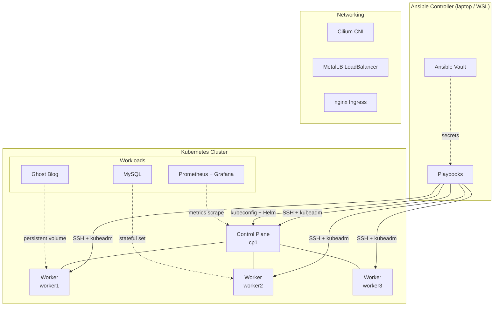

# Ansible Kubernetes Homelab

A production-style Kubernetes cluster provisioned and operated entirely through Ansible. Built on local VMs as a homelab; designed with patterns that scale to real infrastructure.

## What This Project Demonstrates

- **Cluster provisioning from scratch** — bare Ubuntu VMs to working Kubernetes cluster with one set of playbooks
- **Day-2 operations** — rolling config updates, secret rotation, node addition, and Kubernetes version upgrades with no downtime
- **GitOps-adjacent workflow** — declarative manifests in Git, applied via Ansible-templated lookups, with checksum-triggered pod rollouts on config change
- **Multi-environment patterns** — separate inventories for lab and prod with isolated credentials per environment
- **Real failure recovery** — every issue encountered during development is documented with its root cause and fix

## End Results
- **Running K8S cluster set up with Ansible
- **App's deployed to simulate real world cases(Grafana, Ghost)

## Architecture

## Stack

| Layer | Component | Version |
|---|---|---|
| OS | Ubuntu Server | 24.04 LTS |
| Container Runtime | containerd | 2.x |
| Cluster | Kubernetes (kubeadm) | 1.33.x |
| CNI | Cilium | 1.16.x |
| LoadBalancer | MetalLB | 0.14.x |
| Ingress | ingress-nginx | 4.12.x |
| Storage | local-path-provisioner | v0.0.31 |
| Monitoring | kube-prometheus-stack | 66.x |
| Sample App | Ghost CMS + MySQL | 5.x / 8.0 |
| Automation | Ansible | 2.20.x |
| CI | GitHub Actions | — |

### Prerequisites

- Ansible 2.20+ (recommend via `pipx install --include-deps ansible`)
- A VM provider — this project was developed against Multipass on Windows/WSL using VirtualBox
- ~8GB RAM on the host for four 2GB VMs

### Initial setup

I created project instructions by asking Claude to provide me an exercise to go through based on my specifications for learning Ansible and k8S. 

At the start it gave very vague instructions and i had to prompt a bit more to get it to give me something i could follow. 

I started between picking multipass or vagrant for underlying infrastructure for VM's. I went multipass just to try it out with Virtualbox supporting the environment. 

I want to try vagrant in the future but if i use multipass again i will not use virtualbox with it. Too many startup issues related to bridge adapter. 

After i had VM's running on my pc the next steps were playbooks 1-4 to get cluster up and running. 

Then remaining playbooks to go that extra mile with version upgrades, rotating certs, etc. 

## Lessons Learned 

### Don't use virtualbox with multipass it is more trouble than its worth. If i was to do again i would use Vmware or force hyperv on windows home. 

### Clock drift after VM stop/start cycles

Multipass VMs accumulated hours of clock drift between sessions. Chrony's default gradual slewing could not catch up fast enough on boot, causing TLS certificate validation errors during image pulls (because newly-issued certs appeared to be from the future). Resolution: configured chrony with `makestep 1.0 -1` to step large offsets immediately rather than slewing, baked into the Phase 1 common role.

### I allowed claude to pick the DB for Ghost blog site i eventually set up and there were dependancy issues and i ultimately had to change from postgres to mysql to support. Some time lost but good lesson.

## Stretch Goals (not yet implemented)

- Molecule-based testing of roles against ephemeral Docker containers
- External Secrets Operator integration to replace Ansible Vault with a real secret manager (Vault, AWS Secrets Manager, etc.)
- Loki + Promtail for log aggregation alongside Prometheus
- Terraform for VM provisioning (currently manual `multipass launch`)
- TLS via cert-manager + Let's Encrypt for the ingress

## Project Constraints

This is a homelab built on 2-4GB Multipass VMs running on a single host. Where this project differs from production:

- **Resource limits are tight.** Pod resource requests are tuned for a tiny cluster; production would have larger reservations and dedicated nodes.
- **Storage is node-local.** local-path-provisioner means a node failure loses that node's persistent data. Production would use replicated storage (Longhorn, Ceph, NFS).
- **No HA control plane.** Single control plane node. Production would use three control plane nodes with a load balancer.
- **No TLS on ingress.** All HTTP. Adding cert-manager is the stretch goal.

The architecture and patterns transfer to production; the scale doesn't.

